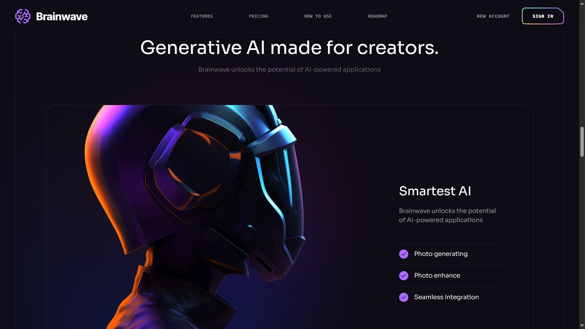

# Brainwave

Brainwave is a powerful AI chat app designed to enhance productivity and streamline communication. Built with React, styled with Tailwind CSS, and created using Vite for fast development, this website leverages reusable components for a modular and efficient structure. Explore the possibilities of AI chatting with Brainwave.

## Features

- **`AI-Powered Chatting`**: Engage with AI to assist in a variety of tasks.
- **`Seamless Communication`**: Smooth interactions with AI for a user-friendly experience.
- **`Reusable Components`**: The app is built using modular and reusable components to ensure a clean and scalable codebase.
- **`Responsive Design`**: Optimized for various screen sizes with Tailwind CSS.
- **`Fast Development with Vite`**: Utilizes Vite for a blazing-fast development environment.

## Tech Stack

- **`React`**: For building interactive user interfaces.
- **`Tailwind CSS`**: For utility-first CSS styling, ensuring a responsive and customizable design.
- **`Vite`**: For fast builds and optimized performance.
- **`HTML/CSS`**: For the core structure and styling of the app.
- **`React Router DOM`**: For seamless page navigation.
- **`React Just Parallax`**: For smooth parallax scrolling effects.

## Setup

1. Clone the repository:

   ```bash
   git clone https://github.com/your-username/project-brainwave.git
   ```

2. Navigate to the project directory:

   ```bash
   cd project-brainwave
   ```

3. Install dependencies:

   ```bash
   npm install
   ```

4. Start the development server:

   ```bash
   npm run dev
   ```

## Available Scripts

- `dev`: Runs the app in development mode using Vite.

- `build`: Builds the app for production.

- `lint`: Runs ESLint to check for code quality issues.

- `preview`: Previews the production build locally.

## Folder Structure

```
/src
  /assets        # Static files like images and icons
  /components    # Reusable React components
  /pages         # Page components
  /styles        # Tailwind CSS and custom styles
  /utils         # Utility functions
  App.jsx        # Main App component
  index.js       # Entry point for the React app
/public
  index.html     # HTML template
```

## Screenshots


<!--  -->





<!--  -->


## Deployed Link

https://project-ai-chatapp.netlify.app/
